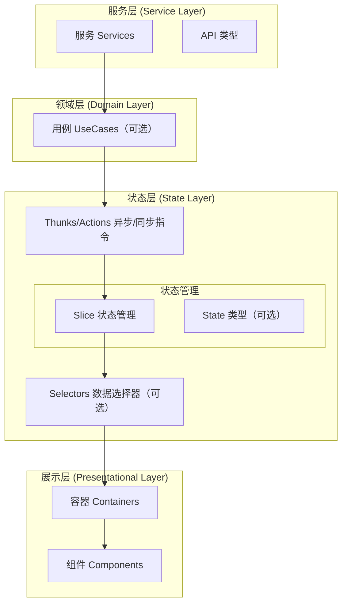
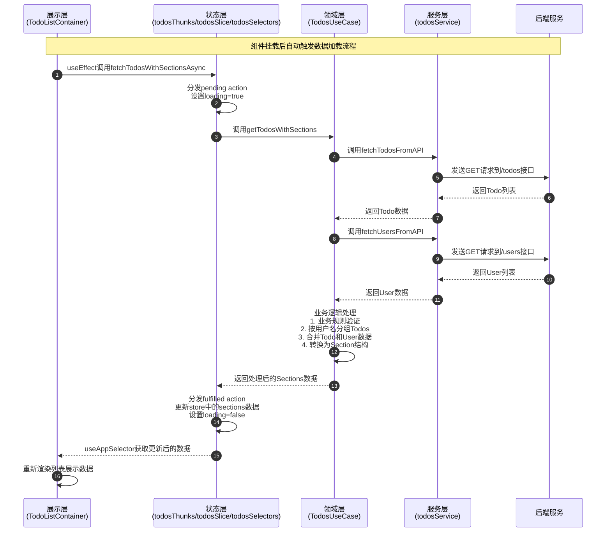
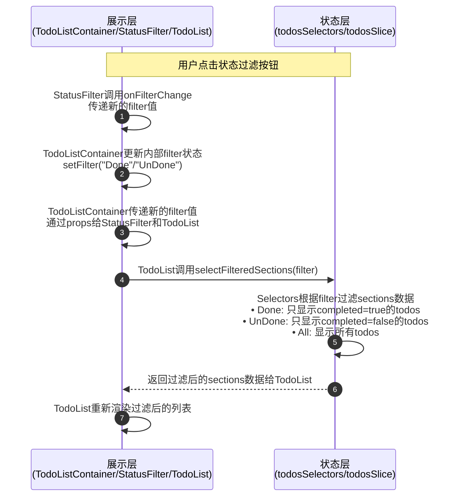
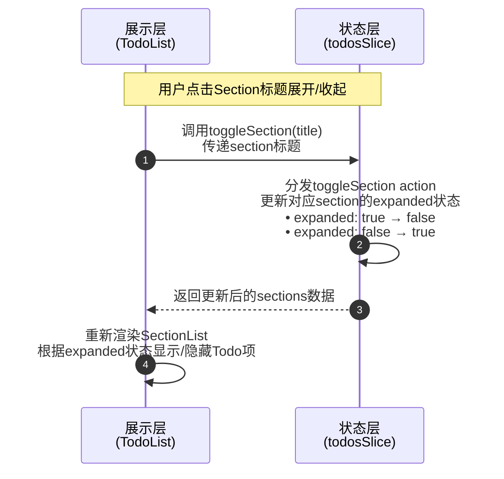
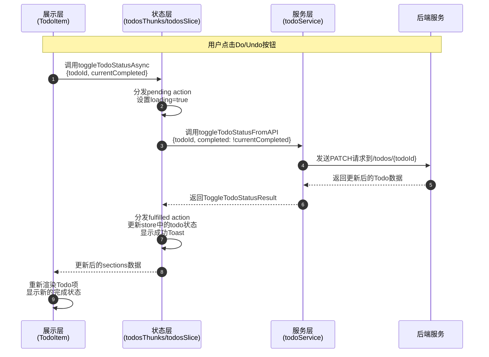
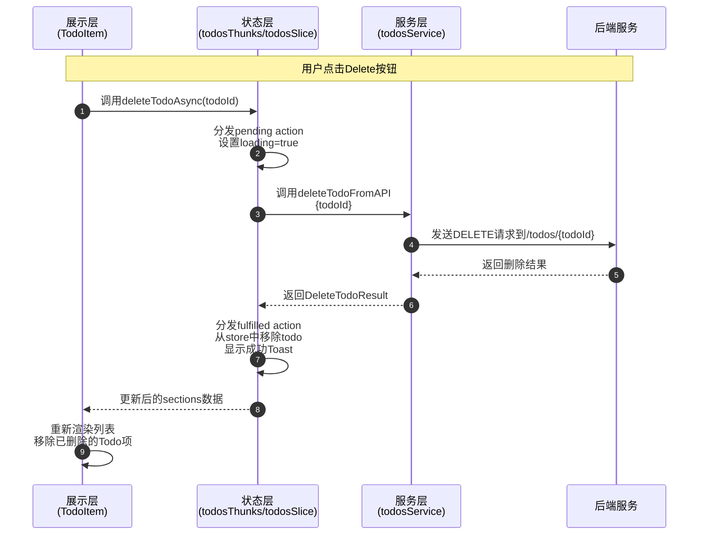
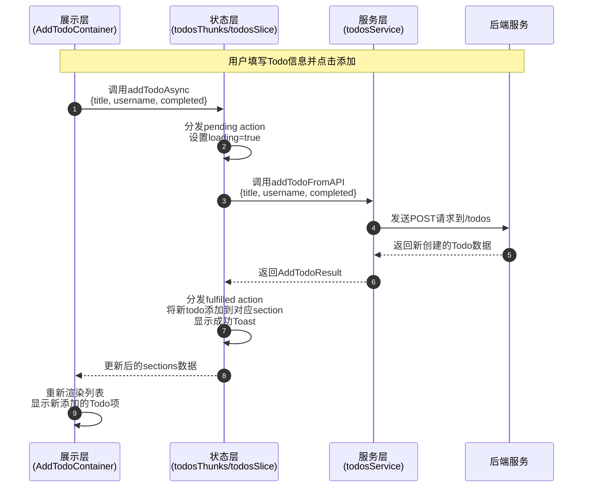

# 分层架构

## 1、架构示意图


## 2、核心原则

- 单一职责：每层专注单一功能，职责边界清晰。
  - 展示层：只处理UI渲染和用户交互，**不处理业务逻辑**。
  - 状态层：专注于管理状态和状态变更。
  - 领域层：只**处理业务规则和数据转换**。
  - 服务层：只负责数据获取和API交互。
- 单向依赖：数据流向。
    - 服务层 → 领域层（可选） → 状态层 → 展示层。
    - **禁止反向依赖或跨层调用**。


## 3、分层（单一）职责

| 层次      | 作用                     | 组成                                                                                        | 目录/文件                                                                                                                                                               |
|---------|------------------------|-------------------------------------------------------------------------------------------|---------------------------------------------------------------------------------------------------------------------------------------------------------------------|
| 展示层     | 负责UI的渲染和与用户的交互         | Containers：负责连接Redux和Component<br>Components：负责UI的渲染 | `src/presentation/features/todos/containers/TodoListContainer.tsx`<br>`src/presentation/features/todos/components/TodoList.tsx`<br>`src/presentation/features/todos/components/TodoItem.tsx`<br>`src/presentation/styles/styles.ts`               |
| 状态层     | 使用Redux Toolkit管理全局状态 | Thunks/Actions：处理异步/同步指令<br>状态管理：<br>• Slice：管理状态和状态变更逻辑<br>• **State类型（可选）：定义状态层使用的数据类型**<br>Selectors（可选）：从store中提取和转换数据              | `src/state/store/todos/todosSlice.ts`<br>`src/state/store/todos/todosThunks.ts`<br>`src/state/store/todos/todosSelectors.ts`<br>`src/state/store/rootReducer.ts`<br>`src/type/state/` |
| 领域层（可选） | 处理复杂业务逻辑，与UI和数据访问层解耦   | UseCases：处理应用的业务逻辑（包含业务规则验证、**Api到State数据转换**）                                                               | `src/domain/todosUseCase.ts`                                                                                                                                        |
| 服务层     | 处理与API的交互，提供数据操作接口     | Services：负责与外部API的交互，提供完整的CRUD操作<br>**API类型：定义API请求参数和响应结果的类**型                                                                      | `src/service/todosService.ts`<br>`src/service/usersService.ts`<br>`src/type/api/`                                                                                                      |

## 4、分层（单向）数据流

以下表格总结了各个场景的数据流流程，时序图展示了详细的交互过程：

| 场景 | 流程 |
|------|------|
| 数据加载场景 | 展示层(组件挂载) → 状态层(Thunk异步调用) → **服务层(API调用) → 领域层(数据处理) → 状态层(状态更新) → 展示层(UI渲染)** |
| 状态过滤场景 | 展示层(用户交互/状态更新/组件传递) → **状态层（选择器过滤数据） → 展示层（重新渲染）** |
| 展开收起场景 | 展示层(用户交互) → 状态层(同步Action) → **状态层(状态更新) → 展示层(重新渲染)** |
| 切换Todo状态场景 | 展示层（用户交互） → 状态层（Thunk异步调用） → **服务层（API更新） → 状态层（状态更新） → 展示层（Toast提示）** |
| 删除Todo场景 | 展示层(用户交互) → 状态层(Thunk异步调用) → **服务层(API删除) → 状态层(状态移除) → 展示层(Toast提示)** |
| 添加Todo场景 | 展示层(用户交互) → 状态层(Thunk异步调用) → **服务层(API创建) → 状态层(状态添加) → 展示层(Toast提示)** |

### 4.1 数据加载场景



### 4.2 状态过滤场景



### 4.3 展开收起场景



### 4.4 切换Todo状态场景



### 4.5 删除Todo场景



### 4.6 添加Todo场景



## 5、实践实施


### 5.1 服务层（Service Layer）

服务层负责与外部API交互，提供完整的数据操作接口。

#### API类型定义

`src/type/api/todo.d.ts`

```typescript
// Todos API数据类型定义
export type Todo = {
    userId: number;
    id: number;
    title: string;
    completed: boolean;
}; 

// API 请求参数类型定义
export type FetchTodosParams = {
    userId?: number;
};

// API 响应结果类型定义
export type FetchTodosResult = Todo[];

// 切换Todo状态相关的类型定义
export type ToggleTodoStatusParams = {
    todoId: number;
    completed: boolean;
};

export type ToggleTodoStatusResult = {
    success: boolean;
    todo: Todo;
};

// 删除Todo相关的类型定义
export type DeleteTodoParams = {
    todoId: number;
};

export type DeleteTodoResult = {
    success: boolean;
    message: string;
};

// 添加Todo相关的类型定义
export type AddTodoParams = {
    title: string;
    username: string;
    completed?: boolean;
};

export type AddTodoResult = {
    success: boolean;
    todo: Todo & { username: string };
}; 
```

`src/type/api/user.d.ts`

```typescript
// Users API数据类型定义
export type User = {
    id: number;
    name: string;
    username: string;
    email: string;
    address: Address;
    phone: string;
    website: string;
    company: Company;
};

export type Address = {
    street: string;
    suite: string;
    city: string;
    zipcode: string;
    geo: Geo;
};

export type Geo = {
    lat: string;
    lng: string;
};

export type Company = {
    name: string;
    catchPhrase: string;
    bs: string;
}; 

// API 请求参数类型定义
export type FetchUsersParams = {
    // 目前用户 API 不需要参数，但保留扩展性
};

// API 响应结果类型定义
export type FetchUsersResult = User[]; 
```

#### Service实现

`src/service/todosService.ts`

```typescript
import { api } from "../utils/api.ts";
import type {
    FetchTodosResult,
    ToggleTodoStatusParams,
    ToggleTodoStatusResult,
    DeleteTodoParams,
    DeleteTodoResult,
    AddTodoParams,
    AddTodoResult
} from "../type/api";

const todosEndpoint = "/todos";

// Tips：服务层 - Service
// 定义：直接与后端 API 交互的纯网络请求封装，不包含业务规则。
// 职责：
// 1. 负责发起 HTTP 请求，返回 Promise 数据；
// 2. 处理最基本的网络错误并抛出异常；
// 3. 与 Domain/UseCase 解耦，便于替换数据源或做单元测试。
// 优势：
// • 单一职责，易于 Mock 和复用；
// • 给上层提供干净、统一的数据获取接口。

/**
 * 获取待办事项列表
 * @returns Promise<FetchTodosResult> - 返回待办事项数组
 * @throws ApiError - 网络错误或服务器错误
 */
export const fetchTodosFromAPI = async (): Promise<FetchTodosResult> => {
    return api.get<FetchTodosResult>(todosEndpoint);
};

/**
 * 切换待办事项状态
 * @param params - 请求参数，包含 todoId 和 completed 状态
 * @returns Promise<ToggleTodoStatusResult> - 返回更新结果
 * @throws ApiError - 网络错误或服务器错误
 */
export const toggleTodoStatusFromAPI = async (
    params: ToggleTodoStatusParams
): Promise<ToggleTodoStatusResult> => {
    const { todoId, completed } = params;
    return api.patch<ToggleTodoStatusResult>(`${todosEndpoint}/${todoId}`, { completed });
};

/**
 * 删除待办事项
 * @param params - 请求参数，包含 todoId
 * @returns Promise<DeleteTodoResult> - 返回删除结果
 * @throws ApiError - 网络错误或服务器错误
 */
export const deleteTodoFromAPI = async (
    params: DeleteTodoParams
): Promise<DeleteTodoResult> => {
    const { todoId } = params;
    return api.delete<DeleteTodoResult>(`${todosEndpoint}/${todoId}`);
};

/**
 * 添加待办事项
 * @param params - 请求参数，包含 title, username, completed
 * @returns Promise<AddTodoResult> - 返回添加结果
 * @throws ApiError - 网络错误或服务器错误
 */
export const addTodoFromAPI = async (
    params: AddTodoParams
): Promise<AddTodoResult> => {
    return api.post<AddTodoResult>(todosEndpoint, params);
};
```

### 5.2 领域层（Domain Layer）

领域层处理复杂业务逻辑，包含业务规则验证和数据转换。

`src/domain/todosUseCase.ts`

```typescript
import {fetchTodosFromAPI} from "../service/todosService";
import {fetchUsersFromAPI} from "../service/usersService";
import type {Section, TodoForUI} from "../type/state";
import type {User} from "../type/api/user";
import type {Todo} from "../type/api/todo";

// Tips：领域层 - UseCase
// 定义：封装业务规则的应用服务，独立于框架与界面，只关心领域数据转换。
// 职责：
// 1. 协调多个 Service，获取 Todo 与 User 基础数据；
// 2. 执行业务逻辑：按用户名分组、合并数据，转换为 Section 结构；
// 3. 业务规则验证：确保数据符合业务要求；
// 4. 数据格式转换：将业务数据转换为UI展示格式；
// 5. 向外暴露纯 Promise<Section[]> 结果，供 State/Thunk 调用。
// 优势：
// • 业务逻辑与状态/UI 解耦，可在 Node 测试或其他前端复用；
// • 单一出口，集中修改复杂规则；
// • 纯函数 + Promise，易于测试与类型推导；
// • 业务规则验证确保数据质量；
// • 数据格式转换确保UI展示一致性。

// 业务规则验证1：Todo标题不能为空
const validateTodoTitle = (todo: Todo): boolean => {
    return Boolean(todo.title && todo.title.trim().length > 0);
};

// 业务规则验证2：Todo必须属于有效用户
const validateTodoUser = (todo: Todo, users: User[]): boolean => {
    return users.some(user => Number(user.id) === todo.userId);
};

// 业务规则：生成section标题（用户名 + 邮箱）
const generateSectionTitle = (username: string, email: string): string => {
    return `${username} (${email})`;
};

export const getTodosWithSections = async (): Promise<Section[]> => {
  const todos = await fetchTodosFromAPI();
  const users = await fetchUsersFromAPI();

    // 应用业务规则验证：过滤无效数据
    const validTodos = todos.filter(todo => {
        const hasValidTitle = validateTodoTitle(todo);
        const hasValidUser = validateTodoUser(todo, users);
        
        // 记录被过滤的数据（可选，用于调试）
        if (!hasValidTitle) {
            console.warn(`Todo ${todo.id} has empty title, filtered out`);
        }
        if (!hasValidUser) {
            console.warn(`Todo ${todo.id} has invalid userId: ${todo.userId}, filtered out`);
        }
        
        return hasValidTitle && hasValidUser;
    });
    
    // 业务逻辑：将有效的todos按用户名分组，并添加用户名信息
    const grouped = validTodos.reduce((acc, todo) => {
        const findUser = users.find((user: User) => Number(user.id) === todo.userId);
    const username = findUser ? findUser.username : "Unknown";
    if (!acc[username]) {
      acc[username] = [];
    }
    acc[username].push({...todo, username});
    return acc;
    }, {} as Record<string, TodoForUI[]>);

    // 业务逻辑：转换为Section结构，title包含用户名和邮箱
    return Object.keys(grouped).map(username => {
        const findUser = users.find((user: User) => user.username === username);
        const email = findUser ? findUser.email : "unknown@example.com";
        
        return {
            title: generateSectionTitle(username, email),
    data: grouped[username],
    expanded: true,
        };
    });
};
```

### 5.3 状态层（State Layer）

状态层使用 Redux Toolkit 管理全局状态，包含 Thunks、Actions、Slice 和 Selectors。

#### State类型定义

`src/type/state/todo.d.ts`

```typescript
// UI展示用的类型，包含username
export type TodoForUI = {
    id: number;
    username: string;
    title: string;
    completed: boolean;
}

// Section类型定义，用于UI展示的二级列表
export interface Section {
    title: string;
    data: TodoForUI[];
    expanded: boolean;
}
```

`src/type/state/user.d.ts`

```typescript
// UI展示用的User类型，只包含展示必要的字段
export type UserForUI = {
    id: number;
    username: string;
    name: string;
}; 
```

`src/type/state/filter.ts`

```typescript
export const FilterTypes = ["All", "Done", "UnDone"] as const;
export type FilterType = typeof FilterTypes[number];

export const filterPredicate: Record<FilterType, (completed: boolean) => boolean> = {
  All: () => true,
  Done: (c) => c,
  UnDone: (c) => !c,
}; 
```

#### Thunks（异步指令）

`src/state/store/todos/todosThunks.ts`

```typescript
import { createAsyncThunk } from "@reduxjs/toolkit";
import type { Section } from "../../../type/state";
import { getTodosWithSections } from "../../../domain/todosUseCase.ts";
import { toggleTodoStatusFromAPI, deleteTodoFromAPI, addTodoFromAPI } from "../../../service/todosService.ts";
import type { AddTodoParams } from "../../../type/api";
import type { AppError } from "../../../type/error";
import { handleApiError } from "../../../utils/error";
import { showSuccessToast, showErrorToast } from "../../../utils/toast.ts";

// Tips：状态层-Thunk（异步 Action）
// 定义：返回函数的 Action Creator，由 redux-thunk 中间件执行，用于处理副作用与异步流程。
// 职责：
// 1. 调用 Domain/Service 获得数据或执行副作用。
// 2. 根据结果自动派发 pending / fulfilled / rejected 等生命周期 Action。
// 3. 将数据写入 Slice，间接驱动 UI 更新。
// 4. 统一错误处理：使用统一的错误类型和处理策略。
// 优势：
// • 隔离网络 / IO 等副作用，保持 Reducer 纯净；
// • 配合 createAsyncThunk 自动生成 Action Type，减少样板；
// • 完整的类型推断与统一错误处理；
// • 统一的错误处理策略，提高可维护性。

// 异步 thunk：获取 todos 并按用户名分组
export const fetchTodosWithSectionsAsync = createAsyncThunk<
    Section[],
    void,
    { rejectValue: AppError }
>("todos/fetchTodosWithSections", async (_, { rejectWithValue }) => {
    try {
        return await getTodosWithSections();
    } catch (error) {
        const appError = handleApiError(error);
        return rejectWithValue(appError);
    }
});

// 异步 thunk：切换待办事项状态
export const toggleTodoStatusAsync = createAsyncThunk<
    any, // ToggleTodoStatusResult
    { todoId: number; currentCompleted: boolean },
    { rejectValue: AppError }
>(
    "todos/toggleTodoStatus",
    async ({ todoId, currentCompleted }, { rejectWithValue }) => {
        try {
            const result = await toggleTodoStatusFromAPI({
                todoId,
                completed: !currentCompleted
            });

            showSuccessToast("Todo status updated successfully");
            return result;
        } catch (error) {
            const appError = handleApiError(error);
            showErrorToast(`Failed to update todo status: ${appError.message}`);
            return rejectWithValue(appError);
        }
    }
);

// 异步 thunk：删除待办事项
export const deleteTodoAsync = createAsyncThunk<
    any, // DeleteTodoResult
    number, // todoId
    { rejectValue: AppError }
>(
    "todos/deleteTodo",
    async (todoId, { rejectWithValue }) => {
        try {
            const result = await deleteTodoFromAPI({ todoId });
            showSuccessToast("Todo deleted successfully");
            return result;
        } catch (error) {
            const appError = handleApiError(error);
            showErrorToast(`Failed to delete todo: ${appError.message}`);
            return rejectWithValue(appError);
        }
    }
);

// 异步 thunk：添加待办事项
export const addTodoAsync = createAsyncThunk<
    any, // AddTodoResult
    AddTodoParams,
    { rejectValue: AppError }
>(
    "todos/addTodo",
    async (params, { rejectWithValue }) => {
  try {
            const result = await addTodoFromAPI(params);
            showSuccessToast("Todo added successfully");
            return result;
  } catch (error) {
            const appError = handleApiError(error);
            showErrorToast(`Failed to add todo: ${appError.message}`);
            return rejectWithValue(appError);
        }
  }
);
```

#### Slice（状态管理）

`src/state/store/todos/todosSlice.ts`

```typescript
import { createSlice, PayloadAction } from "@reduxjs/toolkit";
import type { Section } from "../../../type/state";
import type { AppError } from "../../../type/error";
import { fetchTodosWithSectionsAsync, toggleTodoStatusAsync, deleteTodoAsync, addTodoAsync } from "./todosThunks.ts";

interface TodosState {
    sections: Section[];
    loading: boolean;
    error: AppError | null;
}

const initialState: TodosState = {
    sections: [],
  loading: false,
    error: null,
};

// Tips：状态层-Slice
// 定义：由 Redux Toolkit 的 createSlice 生成的 state 片段，内聚 Reducer 与同步 Action Creator。
// 职责：
// 1. 声明 todos 状态结构与初始值；
// 2. 提供 addTodo / deleteTodo 等同步更新逻辑；
// 3. 在 extraReducers 中消费异步 Thunk 的生命周期 Action；
// 4. 统一错误处理：使用统一的错误类型和处理策略。
// 优势：
// • 自动生成 Action Type，减少 switch 树与样板；
// • 内置 Immer，可用"可变"语法编写纯函数；
// • 状态、逻辑、Action 同文件集中，易于维护与重构；
// • 统一的错误处理策略，提高可维护性。

// 统一错误处理函数
const handleRejectedAction = (state: TodosState, action: any) => {
    state.loading = false;
    state.error = action.payload || {
        code: 'UNKNOWN_ERROR',
        message: action.error.message || 'An unknown error occurred',
        timestamp: Date.now(),
    };
};

const todosSlice = createSlice({
    name: "todos",
    initialState,
    reducers: {
        toggleSection: (state, { payload }: PayloadAction<string>) => {
            state.sections = state.sections.map((section) =>
                section.title === payload
                    ? { ...section, expanded: !section.expanded }
              : section
            );
        },
    },
    extraReducers: (builder) => {
        builder
            // fetchTodosWithSections async
            .addCase(fetchTodosWithSectionsAsync.pending, (state) => {
                state.loading = true;
                state.error = null;
            })
            .addCase(fetchTodosWithSectionsAsync.fulfilled, (state, { payload }) => {
                state.loading = false;
                state.sections = payload;
            })
            .addCase(fetchTodosWithSectionsAsync.rejected, handleRejectedAction)

            // toggleTodoStatus async
            .addCase(toggleTodoStatusAsync.fulfilled, (state, { payload }) => {
                state.sections = state.sections.map(section => ({
                    ...section,
                    data: section.data.map(todo =>
                        todo.id === payload.todo.id
                            ? { ...todo, completed: payload.todo.completed }
                            : todo
                    )
                }));
            })
            .addCase(toggleTodoStatusAsync.rejected, handleRejectedAction)

            // deleteTodo async
            .addCase(deleteTodoAsync.fulfilled, (state, { meta }) => {
                const todoId = meta.arg;
                state.sections = state.sections
                    .map((section) => ({
                        ...section,
                        data: section.data.filter((todo) => todo.id !== todoId),
                    }))
                    .filter((section) => section.data.length > 0);
            })
            .addCase(deleteTodoAsync.rejected, handleRejectedAction)

            // addTodo async
            .addCase(addTodoAsync.fulfilled, (state, { payload }) => {
                const newTodo = payload.todo;
                const sectionExists = state.sections.some(section => 
                    section.title.includes(newTodo.username)
                );
                
                if (sectionExists) {
                    state.sections = state.sections.map(section =>
                        section.title.includes(newTodo.username)
                            ? { ...section, data: [...section.data, newTodo] }
                            : section
                    );
                } else {
                    state.sections.push({
                        title: `${newTodo.username} (unknown@example.com)`,
                        data: [newTodo],
                        expanded: true,
                    });
                }
            })
            .addCase(addTodoAsync.rejected, handleRejectedAction);
    },
});

// Tips：状态层-同步 Action
// 定义：由 createSlice 自动生成的同步 Action Creator 与对应 reducer。
// 职责：
// 1. 处理无需副作用的本地状态变更（如 add/delete/mark）。
// 2. 返回新的状态或通过 Immer 直接修改草稿 state。
// 优势：
// • Action Type 自动生成，少写常量；
// • 与 Slice 同文件，逻辑集中；
// • 受益于 Immer，可写"可变"语法提升可读性。
export const { toggleSection } = todosSlice.actions;
export default todosSlice.reducer;
```

#### Selectors（数据选择器）

`src/state/store/todos/todosSelectors.ts`

```typescript
import { createSelector } from 'reselect';
import type { RootState } from '../rootReducer.ts';
import type { FilterType } from '../../../type/state/filter';

// Tips：状态层-Selectors（可选）
// 定义：从 Redux store 中提取和转换数据的纯函数，支持缓存和组合。
// 职责：
// 1. 从 store 中提取原始数据；
// 2. 根据业务需求转换数据格式；
// 3. 支持带参数的动态选择器；
// 4. 提供缓存机制，避免重复计算。
// 优势：
// • 数据转换逻辑集中，便于维护；
// • 支持缓存，提高性能；
// • 类型安全，减少运行时错误；
// • 可组合，支持复杂的数据查询。

// 基本选择器：获取todos状态
const selectTodosState = (state: RootState) => state.todos;

// 选择器：获取sections列表
export const selectSections = createSelector(
  [selectTodosState],
  (todosState) => todosState.sections
);

// 选择器：获取loading状态
export const selectLoading = createSelector(
  [selectTodosState],
  (todosState) => todosState.loading
);

// 选择器：获取error状态
export const selectError = createSelector(
  [selectTodosState],
  (todosState) => todosState.error
);

// 带参数的选择器：根据过滤器获取sections
export const selectFilteredSections = (state: RootState, filter: FilterType) => {
  const sections = selectSections(state);
  
  switch (filter) {
    case 'Done':
      return sections.map(section => ({
        ...section,
        data: section.data.filter(todo => todo.completed),
      })).filter(section => section.data.length > 0);
    case 'UnDone':
      return sections.map(section => ({
        ...section,
        data: section.data.filter(todo => !todo.completed),
      })).filter(section => section.data.length > 0);
    default:
      return sections;
  }
};
```

### 5.4 展示层（Presentational Layer）

展示层负责UI渲染和用户交互，包含 Containers 和 Components。

#### Containers（容器组件）

`src/presentation/features/todos/containers/TodoListContainer.tsx`

```typescript
import React, { useEffect, useState } from "react";
import { View, Text, StyleSheet } from "react-native";
import { useAppDispatch } from "../../../../state/store/hooks";
import { fetchTodosWithSectionsAsync } from "../../../../state/store/todos/todosThunks";
import { FilterType } from "../../../../type/state/filter";
import { ThemeConsumer } from "../../../../state/context/ThemeProvider";
import { styles as commonStyles } from "../../../styles/styles";
import StatusFilter from "../components/StatusFilter";
import TodoList from "../components/TodoList";
import TodoActions from "../components/TodoActions";

// Tips：展示层 - Container（容器组件）
// 定义：负责连接Redux和Component的容器组件，管理UI状态和组件组合。
// 职责：
// 1. 组合和布局子组件，处理组件间的协调
// 2. 管理UI状态（如filter状态），通过props传递给子组件
// 3. 处理全局主题和导航等跨组件功能
// 4. 负责数据初始化，触发异步数据加载
// 5. 订阅必要的Redux状态，但不直接处理业务逻辑
// 优势：
// • 将UI状态与业务状态分离，职责清晰
// • 子组件可复用，减少重复代码
// • 便于独立测试，提高代码质量
// • 组件间耦合度低，修改影响范围小
// • 状态管理清晰，便于调试和维护
const TodoListContainer: React.FC = () => {
    const dispatch = useAppDispatch();
    
    // UI状态：在容器组件中管理
    const [filter, setFilter] = useState<FilterType>("All");

    // 初始化逻辑：确保数据依赖关系正确
    useEffect(() => {
        dispatch(fetchTodosWithSectionsAsync());
    }, [dispatch]);
    
    return (
        <ThemeConsumer>
            {({ titleColor }) => (
                <View style={commonStyles.container}>
                    {/* 标题区域 */}
                    <Text style={[{ color: titleColor }, commonStyles.title]}>
                        Todo List
                    </Text>
                    
                    {/* 状态过滤区域 */}
                    <StatusFilter
                        filter={filter}
                        onFilterChange={setFilter}
                        titleColor={titleColor}
                    />
                    

                    {/* 列表内容区域 */}
                    <View style={styles.listContainer}>
                        <TodoList filter={filter} />
                        <TodoActions />
                    </View>
                </View>
            )}
        </ThemeConsumer>
    );
};

const styles = StyleSheet.create({
    listContainer: {
        flex: 1,
        justifyContent: "space-between",
    },
});

export default TodoListContainer;
```

#### Components（展示组件）

`src/presentation/features/todos/components/TodoList.tsx`

```typescript
import React from "react";
import { View, Text, ActivityIndicator, StyleSheet } from "react-native";
import { SectionList, TouchableOpacity, Image } from "react-native";
import { useAppDispatch, useAppSelector } from "../../../../state/store/hooks";
import { toggleSection } from "../../../../state/store/todos/todosSlice";
import { selectFilteredSections, selectLoading, selectError } from "../../../../state/store/todos/todosSelectors";
import type { FilterType } from "../../../../type/state/filter";
import TodoItem from "./TodoItem";

// 类型定义：TodoList组件的Props
interface TodoListProps {
    filter: FilterType;
}

// Tips：展示层 - Component（展示组件）
// 定义：负责UI渲染和用户交互的纯展示组件，直接订阅Redux业务状态。
// 职责：
// 1. 根据props和Redux状态渲染UI界面
// 2. 处理用户交互事件，分发Redux actions
// 3. 管理加载状态、错误状态、正常状态的UI展示
// 4. 处理列表渲染、虚拟化等性能优化
// 5. 不处理业务逻辑，只关注UI展示和交互
// 优势：
// • 组件职责明确，只处理UI渲染逻辑
// • 直接订阅Redux业务状态，减少props传递
// • 可在多个页面复用，减少重复代码
// • 便于独立测试，提高代码质量
// • 状态处理清晰，便于调试和维护
const TodoList: React.FC<TodoListProps> = ({ filter }) => {
    const dispatch = useAppDispatch();

    // 直接订阅Redux业务状态
    const sections = useAppSelector(state => selectFilteredSections(state, filter));
    const loading = useAppSelector(selectLoading);
    const error = useAppSelector(selectError);

    // 加载状态处理
    if (loading) {
        return <ActivityIndicator size="large" color="#0000ff" />;
    }

    // 错误状态处理
    if (error) {
        return <Text style={styles.errorText}>Error: {error.message}</Text>;
    }

    // 正常状态处理
    return (
                            <SectionList
            sections={sections}
                                keyExtractor={(item) => item.id.toString()}
            renderSectionHeader={({ section: { title, expanded } }) => (
                <TouchableOpacity onPress={() => dispatch(toggleSection(title))}>
                                        <View style={styles.sectionHeader}>
                                            <Text style={styles.sectionTitle}>{title}</Text>
                                            <Image
                            source={expanded ? require("../../../../assets/icons/setion_header_down.png") : require("../../../../assets/icons/section_header_up.png")}
                                               style={styles.icon}
                                             />
                                        </View>
                                    </TouchableOpacity>
                                )}
            renderItem={({ item, section }) =>
                section.expanded ? <TodoItem todo={item} /> : null
                                }
                                style={styles.flatList}
                            />
    );
};

const styles = StyleSheet.create({
    flatList: {
        flex: 1,
    },
    errorText: {
        textAlign: "center",
        color: "red",
        fontSize: 16,
        marginTop: 20,
    },
    sectionHeader: {
        flexDirection: "row",
        justifyContent: "space-between",
        alignItems: "center",
        padding: 10,
        backgroundColor: "#f0f0f0",
    },
    sectionTitle: {
        fontSize: 16,
        fontWeight: "bold",
    },
    icon: {
        width: 20,
        height: 20,
    },
});

export default TodoList;
```

`src/presentation/features/todos/components/TodoItem.tsx`

```typescript
import React from "react";
import { View, Text, StyleSheet } from "react-native";
import { useAppDispatch } from "../../../../state/store/hooks";
import { toggleTodoStatusAsync, deleteTodoAsync } from "../../../../state/store/todos/todosThunks";
import type { TodoForUI } from "../../../../type/ui";
import TodoButton from "../../../components/TodoButton";

// 类型定义：TodoItem组件的Props
interface TodoItemProps {
    todo: TodoForUI;
}

// Tips：展示层 - Component（展示组件）
// 定义：负责单个Todo项渲染和交互的展示组件，直接订阅Redux状态。
// 职责：
// 1. 根据props渲染单个Todo项的UI界面
// 2. 处理Todo项的交互事件（切换状态、删除）
// 3. 管理Todo项的视觉状态（完成/未完成样式）
// 4. 分发Redux actions处理用户操作
// 5. 不处理业务逻辑，只关注单个Todo项的展示和交互
// 优势：
// • 组件职责单一，只处理单个Todo项的渲染逻辑
// • 直接分发Redux actions，减少props传递
// • 可在多个列表组件中复用
// • 便于独立测试，提高代码质量
// • 交互处理清晰，便于调试和维护

const TodoItem: React.FC<TodoItemProps> = ({ todo }) => {
    const dispatch = useAppDispatch();
    const isDone = todo.completed;

    const handleDelete = () => {
        dispatch(deleteTodoAsync(todo.id));
    };

    const handleToggleDone = () => {
        dispatch(toggleTodoStatusAsync({ 
            todoId: todo.id, 
            currentCompleted: todo.completed 
        }));
    };

    const buttonTitle = isDone ? "Undo" : "Done";

    return (
        <View style={styles.itemContainer}>
            <Text style={[styles.itemText, isDone && styles.strikeThrough]}>
                {todo.title}
            </Text>
            <View style={styles.buttonContainer}>
                <TodoButton
                    title={buttonTitle}
                    onPress={handleToggleDone}
                    style={isDone ? styles.doneButton : undefined}
                />
                <TodoButton title="Delete" onPress={handleDelete} style={styles.deleteButton} />
            </View>
        </View>
    );
};

const styles = StyleSheet.create({
    itemContainer: {
        flexDirection: "row",
        marginBottom: 10,
        alignItems: "center",
    },
    itemText: {
        flex: 1,
        marginRight: 6,
        fontSize: 16,
        color: "#000",
    },
    strikeThrough: {
        textDecorationLine: "line-through",
        color: "gray",
    },
    buttonContainer: {
        flexDirection: "row",
    },
    doneButton: {
        backgroundColor: "gray",
    },
    deleteButton: {
        marginLeft: 6,
    },
});

export default TodoItem;
```
