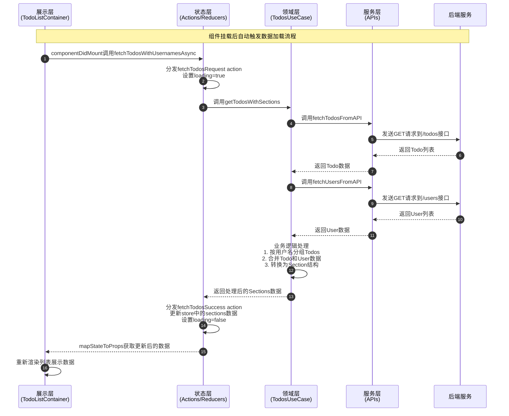

# 分层架构

## 1、核心原则

- 单一职责：每层专注单一功能，职责边界清晰。
    - UI层不处理业务逻辑。
    - 服务层不操作组件状态。
- 单向依赖：数据流向。
    - 服务层 → 领域层 → 状态层  → 展示层。
    - 禁止反向依赖或跨层调用。

## 2、架构示意图


## 3、分层（单一）职责

| 层次      | 作用                     | 组成                                                                                        | 目录/文件                                                                                                                                                               |
|---------|------------------------|-------------------------------------------------------------------------------------------|---------------------------------------------------------------------------------------------------------------------------------------------------------------------|
| 展示层     | 负责UI的渲染和与用户的交互         | Containers/Components：负责连接Redux和Component，从Redux store获取数据并分发actions，UI的渲染 | `src/presentation/components/TodoButton.tsx`<br>`src/presentation/features/todos/TodoListContainer.tsx`<br>`src/presentation/styles/styles.ts`                      |
| 状态层     | 使用Redux或其他状态管理工具管理全局状态 | Actions：描述事件，触发状态变化<br>Reducers：处理状态变化逻辑，返回新的状态<br>Selectors（可选）：从store中提取数据              | `src/state/contexts/ThemeProvider.ts`<br>`src/state/store/todos/todosActions.ts`<br>`src/state/store/todos/todosReducer.ts`<br>`src/state/store/todos/todosType.ts` |
| 领域层（可选） | 处理复杂业务逻辑，与UI和数据访问层解耦   | UseCases：处理应用的业务逻辑（通常是异步操作）                                                               | `src/domain/todosUseCase.ts`                                                                                                                                        |
| 服务层     | 处理与API的交互，提供数据操作接口     | Services：负责与外部API的交互                                                                      | `src/service/todoServices.ts`<br>`src/service/userServices.ts`                                                                                                      |

## 4、分层（单向）数据流

以下时序图展示了应用启动后，从组件挂载到数据加载并呈现在界面上的完整流程：



## 5、实践实施


### 5.1 服务层（Service Layer）

服务层负责与外部API（网络接口/原生API等）交互，提供数据访问接口。

`src/service/todosService.ts`

```typescript
import {apiConfig} from "../configs/apiConfig";
import type {Todo} from "../type/api";

const todosApiUrl = `${apiConfig.getConfigByEnv.baseURL}/todos`;

export const fetchTodosFromAPI = async (): Promise<Todo[]> => {
  const response = await fetch(todosApiUrl, {
    method: "GET",
  });

  if (!response.ok) {
    throw new Error("Network response was not ok");
  }

  const data: Todo[] = await response.json();
  return data;
};
```

`src/service/usersService.ts`

```typescript

import { apiConfig } from "../configs/apiConfig";
import type { User } from "../type/api";

const usersApiUrl = `${apiConfig.getConfigByEnv.baseURL}/users`;

export const fetchUsersFromAPI = async (): Promise<User[]> => {
    const response = await fetch(usersApiUrl, {
        method: "GET",
    });

    if (!response.ok) {
        throw new Error("Network response was not ok");
    }

    const data: User[] = await response.json();
    return data;
};

```

### 5.2 领域层（Domain Layer）

领域层处理复杂业务逻辑，与UI和数据访问层解耦。

`src/domain/todosUseCase.ts`

```typescript
import {fetchTodosFromAPI} from "../service/todosService";
import {fetchUsersFromAPI} from "../service/usersService";
import type {Section, TodoWithUsername} from "../type/ui";

export const getTodosWithSections = async (): Promise<Section[]> => {
  const todos = await fetchTodosFromAPI();
  const users = await fetchUsersFromAPI();

  // 业务逻辑：将todos按用户名分组，并添加用户名信息
  const grouped = todos.reduce((acc, todo) => {
    const findUser = users.find(user => Number(user.id) === todo.userId);
    const username = findUser ? findUser.username : "Unknown";
    if (!acc[username]) {
      acc[username] = [];
    }
    acc[username].push({...todo, username});
    return acc;
  }, {} as Record<string, TodoWithUsername[]>);

  // 转换为UI所需的数据结构
  return Object.keys(grouped).map(username => ({
    title: username,
    data: grouped[username],
    expanded: true,
  }));
};
```

### 5.3 状态层（State Layer）

状态层管理全局状态，包含Actions、Reducers和Selectors。

#### Actions

`src/state/store/todos/todosActions.ts`

```typescript
import {
  ADD_TODO,
  DELETE_TODO,
  FETCH_TODOS_REQUEST,
  FETCH_TODOS_SUCCESS,
  FETCH_TODOS_FAILURE,
  // ... 其他导入
} from "./todosTypes.ts";
import {getTodosWithSections} from "../../../domain/todosUseCase.ts";
import type {AppDispatch} from "../rootReducer.ts";

// 同步Action
export const addTodo = (todoWithUsername: TodoWithUsername): AddTodoAction => ({
  type: ADD_TODO,
  payload: todoWithUsername,
});

export const fetchTodosRequest = (): FetchTodosRequestAction => ({
    type: FETCH_TODOS_REQUEST,
});

export const fetchTodosSuccess = (sections: Section[]): FetchTodosSuccessAction => ({
    type: FETCH_TODOS_SUCCESS,
    payload: sections,
});

export const fetchTodosFailure = (error: string): FetchTodosFailureAction => ({
    type: FETCH_TODOS_FAILURE,
    payload: error,
});

// 异步Action
export const fetchTodosWithUsernamesAsync = () => async (dispatch: AppDispatch) => {
  dispatch(fetchTodosRequest());
  try {
    const sections = await getTodosWithSections();
    dispatch(fetchTodosSuccess(sections));
  } catch (error) {
    dispatch(fetchTodosFailure(error.message));
  }
};
```

#### Reducers

`src/state/store/todos/todosReducer.ts`

```typescript
import {
  ADD_TODO,
  DELETE_TODO,
  // ... 其他导入
} from "./todosTypes.ts";
import type {TodoAction} from "./todosTypes.ts";

const initialState = {
  sections: [] as Section[],
  loading: false,
  error: null as string | null,
};

// Reducer遵循不可变性原则
const todosReducer = (state = initialState, action: TodoAction) => {
  switch (action.type) {
    case FETCH_TODOS_REQUEST:
      return {
        ...state,
        loading: true,
        error: null,
      };
    case ADD_TODO:
      const newPayload = action.payload as TodoWithUsername; // 这里确保正确的 payload 类型
      const sectionExists = state.sections.some(section => section.title === newPayload.username);
      return {
        ...state,
        sections: sectionExists
          ? state.sections.map(section =>
            section.title === newPayload.username
              ? {...section, data: [...section.data, newPayload]}
              : section
          )
          : [...state.sections, {title: newPayload.username, data: [newPayload], expanded: true}],
      };
    // ... 其他case处理
    default:
      return state;
  }
};
```

#### Selectors

`src/state/store/todos/todosSelectors.ts`

```typescript
import {createSelector} from 'reselect';
import type {RootState} from '../rootReducer.ts';

// 基本选择器：获取todos状态
const selectTodosState = (state: RootState) => state.todos;

// 选择器：获取todos列表
export const selectSections = createSelector(
  [selectTodosState],
  (todosState) => todosState.sections
);

// 带参数的选择器：根据过滤器获取sections
export const selectFilteredSections = (state: RootState, filter: string) => {
  const sections = selectSections(state);
  switch (filter) {
    case 'Done':
      return sections.map(section => ({
        ...section,
        data: section.data.filter(todo => todo.completed),
      }));
    case 'UnDone':
      return sections.map(section => ({
        ...section,
        data: section.data.filter(todo => !todo.completed),
      }));
    default:
      return sections;
  }
};
```

### 5.4 展示层（Presentational Layer）

展示层负责UI渲染和用户交互，包含Components和Containers。

#### Containers

`src/presentation/features/todos/TodoListContainer.tsx`

```typescript
import React, {Component} from "react";
import {SectionList, View, ActivityIndicator} from "react-native";
import {connect} from "react-redux";
import {fetchTodosWithUsernamesAsync, toggleSection} from "../../../state/store/todos/todosActions.ts";
import TodoItem from "./TodoItem.tsx";
import {
  selectSections,
  selectLoading,
  selectError,
  selectFilteredSections
} from "../../../state/store/todos/todosSelectors.ts";

// 从Redux获取数据，分发actions
class TodoListContainer extends Component<TodoListProps> {
  componentDidMount() {
    this.props.fetchTodosWithUsernamesAsync();
  }

  render() {
    const {loading, error, filterSections} = this.props;
    const {filter} = this.state;
    const filteredSections = filterSections(filter);
    
    return (
        <ThemeConsumer>
            {({titleColor}) => (
                <View style={commonStyles.container}>
                    <Text style={[{color: titleColor}, commonStyles.title]}>
                        Todo List
                    </Text>
                    <View style={styles.filterContainer}>
                        {['All', 'Done', 'UnDone'].map((type) => (
                            <TouchableOpacity
                                key={type}
                                onPress={() => this.setFilter(type)}
                                style={[
                                    styles.filterButton,
                                    filter === type && {backgroundColor: titleColor},
                                ]}
                            >
                                <Text
                                    style={[
                                        styles.filterButtonText,
                                        filter === type && {color: 'white'},
                                    ]}
                                >
                                    {type}
                                </Text>
                            </TouchableOpacity>
                        ))}
                    </View>
                    <View style={styles.listContainer}>
                        {loading ? (
                            <ActivityIndicator size="large" color="#0000ff"/>
                        ) : error ? (
                            <Text style={styles.errorText}>Error: {error}</Text>
                        ) : (
                            <SectionList
                                sections={filteredSections}
                                keyExtractor={(item) => item.id.toString()}
                                renderSectionHeader={({section: {title, expanded}}) => (
                                    <TouchableOpacity onPress={() => this.props.toggleSection(title)}>
                                        <View style={styles.sectionHeader}>
                                            <Text style={styles.sectionTitle}>{title}</Text>
                                            <Image
                                                source={expanded ? require('../../../assets/icons/setion_header_down.png') : require('../../../assets/icons/section_header_up.png')}
                                               style={styles.icon}
                                             />
                                        </View>
                                    </TouchableOpacity>
                                )}
                                renderItem={({item, section}) =>
                                    section.expanded ? <TodoItem todo={item}/> : null
                                }
                                style={styles.flatList}
                            />
                        )}
                        <TodoButton
                            title="Add Todo"
                            onPress={this.handleAddTodo}
                            style={styles.addButton}
                        />
                    </View>
                </View>
            )}
            </ThemeConsumer>
        );
    }
}

// 连接Redux
const mapStateToProps = (state: RootState) => ({
  sections: selectSections(state),
  loading: selectLoading(state),
  error: selectError(state),
  filterSections: (filter: string) => selectFilteredSections(state, filter),
});

const mapDispatchToProps = (dispatch: AppDispatch) => ({
  fetchTodosWithUsernamesAsync: () => dispatch(fetchTodosWithUsernamesAsync()),
  toggleSection: (title: string) => dispatch(toggleSection(title)),
});

export default connect(mapStateToProps, mapDispatchToProps)(TodoListContainer);
```

#### Components

`src/presentation/components/TodoButton.tsx`

```typescript
import React, {Component} from "react";
import {TouchableOpacity, Text} from "react-native";
import {styles as commonStyles} from "../styles/styles.ts";
import {ThemeConsumer} from "../../state/context/ThemeProvider.tsx";

interface TodoButtonProps {
  title: string;
  onPress: () => void;
  style?: object;
}

class TodoButton extends Component<TodoButtonProps> {
  render() {
    const {title, onPress, style} = this.props;

    return (
      <ThemeConsumer>
        {({buttonBackgroundColor})
  =>
    (
      <TouchableOpacity
        style = {
        [
          {backgroundColor: buttonBackgroundColor},
        commonStyles.buttonBackground,
        style,
  ]
  }
    onPress = {onPress}
    >
    <Text style = {commonStyles.buttonText} > {title} < /Text>
      < /TouchableOpacity>
  )
  }
    </ThemeConsumer>
  )
    ;
  }
}
```
